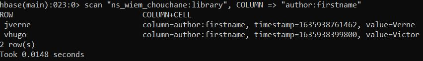
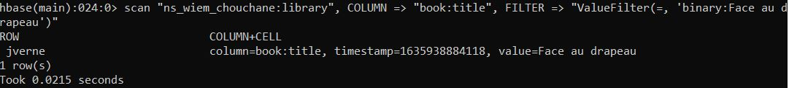

**Wiem CHOUCHANE**

**M2 APP LS1**

&nbsp;

# Lab 1 - Hbase

## 1. Hbase CLI

&nbsp;

(Voir doc : https://hbase.apache.org/book.html)

1.1.1 Commandes de base :

- Connexion SSH au cluster Hadoop :

```shell
ssh wiem.chouchane@hadoop-edge01.efrei.online
```

- Initialisation ticket Kerberos :

```shell
kinit wiem.chouchane
```

- Lancement de l'outil shell de HBase :

```shell
hbase shell
```

- Commandes et output :

    - Commande permettant d'afficher les infos sur le cluster HBase :

    

    - Commande permettant d'afficher la version de Hbase utilisée :

    

    - Commande permettant d'afficher les infos sur l'utilisateur courant :

    

    - Liste des tables du cluster Hbase :

    

    - Déconexion du HBase shell :

    

1.1.2 Création du namespace

```shell
create_namespace "ns_wiem_chouchane"
```

1.1.3 Création de table

  - Création table :

    ```shell
    create "ns_wiem_chouchane:library" , {NAME => "author", VERSIONS => 2},  {NAME => "book", VERSIONS => 3}
    ```

    - Description table :

    ```shell
    describe "ns_wiem_chouchane:library"
    ```


1.1.4 Ajout de valeurs

```shell
put "ns_wiem_chouchane:library", "vhugo", "author:lastname", "Hugo"
```


```shell
put "ns_wiem_chouchane:library", "vhugo", "author:firstname", "Victor"
```

Les autres output de PUT sont similaires à celui du dessus donc ne seront pas pris en screen.

```shell
put "ns_wiem_chouchane:library", "vhugo", "book:title", "La légende des siècles"
```

```shell
put "ns_wiem_chouchane:library", "vhugo", "book:category", "Poemes"
```

```shell
put "ns_wiem_chouchane:library", "vhugo", "book:year", "1855"
```

```shell
put "ns_wiem_chouchane:library", "vhugo", "book:year", "1877"
```

```shell
put "ns_wiem_chouchane:library", "vhugo", "book:year", "1883"
```

```shell
put "ns_wiem_chouchane:library", "jverne", "author:lastname", "Jules"
```

```shell
put "ns_wiem_chouchane:library", "jverne", "author:firstname", "Verne"
```

```shell
put "ns_wiem_chouchane:library", "jverne", "book:publisher", "Hetzel"
```

```shell
put "ns_wiem_chouchane:library", "jverne", "book:title", "Face au drapeau"
```

```shell
put "ns_wiem_chouchane:library", "jverne", "book:year", "1896"
```

1.1.5 Comptage des tuples de la table library :

```shell
count "ns_wiem_chouchane:library"
```


Ici, il n'y a que 2 tuples donc pas besoin de configurer de cache.

1.1.6 Récupération des valeurs

- Récupération des valeurs de toutes les colonnes identifiées par la clé "vhugo" :

```shell
get "ns_wiem_chouchane:library", "vhugo"
```


- Récupération des valeurs des colonnes appartenant à la column family "author" et identifiées par la clé "vhugo" :

```shell
get "ns_wiem_chouchane:library", "vhugo", "author"
```


- Récupération des valeurs de la colonne "firstname" appartenant à la column family "author" et identifiée par la clé "vhugo" :

```shell
get "ns_wiem_chouchane:library", "vhugo", "author:firstname"
```


- Récupération des valeurs des colonnes appartenant à la column family "book" et identifiées par la clé "jverne" :

```shell
get "ns_wiem_chouchane:library", "jverne", COLUMN => "book"
```


- Récupération des valeurs des colonnes "title", "year" et "publisher" appartenant à la column family "book" et identifiées par la clé "jverne" :

```shell
get "ns_wiem_chouchane:library", "jverne", COLUMN => ["book:title", "book:year", "book:publisher"]
```


- Récupération des valeurs correspondant au filtre par valeur appliqué (c'est-à-dire valant ici "Jules") et identifiées par la clé "jverne" :

```shell
get "ns_wiem_chouchane:library", "jverne", FILTER => "ValueFilter(=, 'binary:Jules')"
```


1.1.7 Navigation dans les tuples :

- Scan de toutes les données de la table "library" :

```shell
scan "ns_wiem_chouchane:library"
```


- Scan des données de la column family "book" :

```shell
scan "ns_wiem_chouchane:library", COLUMN => "book"
```


- Scan des données de la colonne "year" appartenant à la column family "book" :

```shell
scan "ns_wiem_chouchane:library", COLUMN => "book:year"
```


- Scan des données des colonnes appartenant à la column family "author" et identifiées par une clé commençant par une lettre comprise entre a et n (sans filtre) :

```shell
scan "ns_wiem_chouchane:library", COLUMN => "author", STARTROW => "a", STOPROW => "n"
```


- Scan des données des colonnes appartenant à la column family "author" et identifiées par une clé commençant par une lettre comprise entre a et n (avec filtre) :

```shell
scan "ns_wiem_chouchane:library", COLUMN => "author", FILTER => "RowFilter(>=, 'binary:a') AND RowFilter(<=, 'binary:n')"
```


- Scan des données de la colonne "firstname" appartenant à la column family "author" :

```shell
scan "ns_wiem_chouchane:library", COLUMN => "author:firstname"
```



- Scan des données dont la valeur de "title" correspond à la valeur paramétrée :

```shell
scan "ns_wiem_chouchane:library", COLUMN => "book:title", FILTER => "ValueFilter(=, 'binary:Face au drapeau')"
```



- Scan des données (de version la plus récente) appartenant à la column family "book" dont la valeur de colonne "year" est inférieure ou égale à 1890 :

```shell
scan "ns_wiem_chouchane:library", {COLUMN => "book:year", FILTER => "ValueFilter(<=, 'binary:1890')", VERSIONS => 1}
```


- Scan des données des colonnes identifiées par une clé commençant par "jv" et correspondant à la regex "[A-Z]([a-z]+){2,}" :

```shell
scan "ns_wiem_chouchane:library", FILTER => "RowFilter(>=, 'binary:jv') AND RowFilter(<, 'binary:jw') AND ValueFilter(=, 'regexstring:[A-Z]([a-z]+){2,}')"
```


1.1.8 Mise à jours de valeurs

- Modification de la valeur de la colonne "lastname" appartenant à la column family "author" et identifiée par "vhugo" en "HAGO" :

```shell
put "ns_wiem_chouchane:library", "vhugo", "author:lastname", "HAGO"
```

- Modification de la valeur de la colonne "lastname" appartenant à la column family "author" et identifiée par "vhugo" en "HUGO" :

```shell
put "ns_wiem_chouchane:library", "vhugo", "author:lastname", "HUGO"
```

- Modification de la valeur de la colonne "firstname" appartenant à la column family "author" et identifiée par "vhugo" en "Victor Marie" :

```shell
put "ns_wiem_chouchane:library", "vhugo", "author:firstname", "Victor Marie"
```

- Modification de la valeur de la colonne "lastname" appartenant à la column family "author" et identifiée par "vhugo" en "Hugo" :

```shell
put "ns_wiem_chouchane:library", "vhugo", "author:lastname", "Hugo"
```

- Récupération des colonnes appartenant à la column family "author" et identifiées par "vhugo" :

```shell
get "ns_wiem_chouchane:library", "vhugo", "author"
```


- Récupération des colonnes appartenant à la column family "author" et identifiées par "vhugo" :

```shell
get "ns_wiem_chouchane:library", "vhugo", COLUMNS => "author"
```


- Récupération des 10 dernières versions des colonnes appartenant à la column family "author" et identifiées par "vhugo" :

```shell
get "ns_wiem_chouchane:library", "vhugo", COLUMNS => "author", VERSIONS => 10
```


1.1.9 Suppression de valeurs / colonnes

Le timestamp de "HUGO" dans le dernier get est 1636199116726.

- Suppression de la valeur author:name=HUGO correspondant au timestamp paramétré :

```shell
deleteall "ns_wiem_chouchane:library", "vhugo", "author:lastname", 1636199116726
```


- Suppression de toutes les valeurs de la colonne "firstname" :

```shell
deleteall "ns_wiem_chouchane:library", "vhugo", "author:firstname"
```


- Suppression de tout le tuple identifié par "vhugo" :

```shell
deleteall "ns_wiem_chouchane:library", "vhugo"
```


- Scan de la version 10 du tuple :

```shell
scan "ns_wiem_chouchane:library", COLUMNS => "author", VERSIONS => 10
```


1.1.10 Suppression de table

- Désactivation de la table :

```shell
disable "ns_wiem_chouchane:library"
```

- Suppression de la table :

```shell
drop "ns_wiem_chouchane:library"
```


1.2.1 Insertion d'une table dans Hbase à partir d'un fichier CSV

- Import du fichier CSV dans HBase :

```shell
hdfs dfs -copyFromLocal ~/trees.csv /user/wiem.chouchane/trees.csv
```

- Vérification de la présence du fichier importé dans HBase :

```shell
hdfs dfs -cat /user/wiem.chouchane/trees.csv
```


- Création de la table "trees" (préfixée du namespace précédent) dans HBase à partir du CSV :

```python
import sys

ROW_KEY_COLUMN_NAME = 'objectid'
TABLE_NAME = 'ns_wiem_chouchane:trees'
GENDER_COLUMN_FAMILY = 'gender'
INFORMATION_COLUMN_FAMILY = 'information'
ADDRESS_COLUMN_FAMILY = 'address'


def main():
    columns = get_all_column_names()
    entry = sys.stdin
    command = get_table_creation_command()
    command = fill_command(command, entry, columns)
    sys.stdout.write(command)


def fill_command(command, entry, columns):
    row_key_column_index = columns.index(ROW_KEY_COLUMN_NAME)
    for line in entry:
        data = line.replace('\n', '').split(';')
        row_key = str(data[row_key_column_index])
        for index, element in enumerate(data):
            if index != row_key_column_index:
                command = add_new_command_line(command, index, row_key, element, columns)
    return command


def get_all_column_names():
    columns = sys.stdin.readline().replace('\n', '').split(';')
    return list(map(lambda column: column.lower(), columns))


def get_table_creation_command():
    return 'create "' + TABLE_NAME + '" , ' \
          '{NAME => "' + GENDER_COLUMN_FAMILY + '", VERSIONS => 10},  ' \
          '{NAME => "' + INFORMATION_COLUMN_FAMILY + '", VERSIONS => 10}, ' \
          '{NAME => "' + ADDRESS_COLUMN_FAMILY + '", VERSIONS => 10};'


def add_new_command_line(command, index, row_key, element, columns):
    meta_data = get_meta_data(index, row_key, columns)
    command += get_new_command_line(meta_data, element)
    return command


def get_meta_data(index, row_key, columns):
    return {
        'row_key': row_key,
        'column_family': get_column_family(index),
        'column': get_column(index, columns)
    }


def get_new_command_line(meta_data, element):
    return 'put "' + \
           TABLE_NAME + '", "' + \
           meta_data['row_key'] + '", "' + \
           meta_data['column_family'] + ':' + \
           meta_data['column'] + '", "' + \
           element + '";'


def get_column_family(index):
    if is_gender_column_family_index(index):
        return GENDER_COLUMN_FAMILY
    elif is_information_column_family_index(index):
        return INFORMATION_COLUMN_FAMILY
    else:
        return ADDRESS_COLUMN_FAMILY


def is_gender_column_family_index(index):
    return 2 <= index <= 4 \
           or 9 <= index <= 10


def is_information_column_family_index(index):
    return 5 <= index <= 7


def get_column(index, columns):
    return columns[index]


if __name__ == "__main__":
    main()
```

- Lancement de la commande de création de la table :

```shell
hdfs dfs -cat /user/wiem.chouchane/trees.csv | python app.py | hbase shell
```

- Description de la table créée :

```shell
describe "ns_wiem_chouchane:trees"
```


- Comptage des tuples créés :

```shell
count "ns_wiem_chouchane:trees"
```


Idem ici, il n'y a pas énormément de tuples donc il n'y a pas besoin de configurer le cache. On a bien 97 tuples correspondant aux 97 lignes insérées depuis le CSV, en effet chacune avait un "OBJECTID" différent comme nous avons pu le constater sur l'exploration ci-dessous :


- Pour l'exemple, récupération des valeurs de toutes les colonnes identifiées par la clé "6" :

```shell
get "ns_wiem_chouchane:trees", "6"
```


